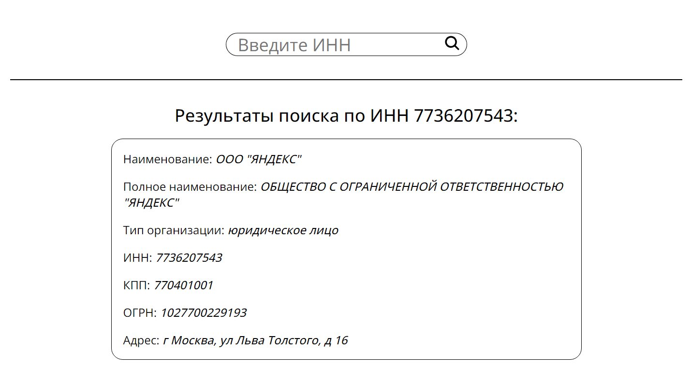

# Тестовое задание на вакансию React разработчик (ООО Эйс Плэйс)

## Деплой приложения
[здесь](https://aceplace-test.vercel.app/)
## Скриншот

## Стэк
- Next.js
- TypeScript
- CSS

## Задание

Необходимо создать сайт из 2 страниц поĸазывающий информацию об
организациях по ИНН. Информацию необходимо получать через сервис
Dadata ( https://dadata.ru/api/find-party/ ).

[Подробное описание задания](aceplace_test_task.pdf) 